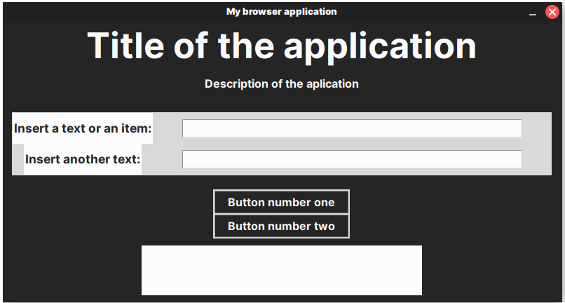

# tkinter-template
A tkinter template with modern IU for small python projects. It can be useful for litle python projects, like scrapping apps, file converters, etc. I made it for personal use, but then I thought it could be useful for someone else too.

This is how it looks like:

## Features
   
 - A title and a description 
 - 2 text input items 
 - 2 Buttons
 - A screen on the bottom to show messages for the users 

## Requirements:

- Python 3
- Tkinter

## Usage

Edit the file adding the functions you want to use at the beggining. Then link them to the inputs and buttons.

## Customization:

Colors and font are declared on variables at the begining of the file.

